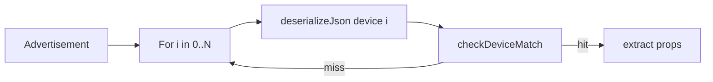

# Accelerate Theengs device matching

Branch notes for making `decodeBLEJson` cheaper on constrained MCUs (and hosts).
JSON device descriptors in `src/devices/` stay the source of truth; accelerate the
**match** path first.

## Why it is slow

Hot path in `decodeBLEJson` (`src/decoder.cpp`):

```text
for each of ~149 devices:
  deserializeJson(doc, _devices[i][0])   // expensive: large DynamicJsonDocument
  checkDeviceMatch(condition, ...)       // cheap after parse
  on hit → extract props → return
```

Dominant cost is **JSON deserialize per candidate**, not the condition DSL itself.
Coalescing conditions alone helps only after you stop reparsing the full descriptor
on every miss.



Consumers that dedupe by MAC+payload cut **volume** but not cost of unknown /
first-seen ads (full scan).

## Can conditions be coalesced in C++?

Yes. The DSL is a small postfix language
(`servicedata` / `manufacturerdata` / `name` / `uuid` + length ops +
`index` / `contain` / `mac@index` + `&` / `|`). Natural compile target:

```cpp
struct MatchPred {
  enum Field { Svc, Mfg, Name, Uuid } field;
  enum LenOp { Eq, Ge, Gt, Le, Lt, None } len_op;
  uint16_t len;           // nibbles or chars, same as today
  uint16_t index_off;     // nibble offset
  const char* prefix;     // hex or name substring
  // plus AND/OR tree or flattened RPN
};
```

Build once at boot (or codegen at compile time from `*_json.h`):

1. Parse each `condition` array **once** into `MatchPred` / RPN bytecode.
2. Store pointer to already-parsed properties JSON (or second-stage native
   property decoders).
3. Match loop: `for (pred : table) if (eval(pred, ad)) …` — no
   `deserializeJson` on the miss path.

That is the real answer to “coalesce condition tests”: **compile the condition
table out of JSON into native predicates** (or a decision tree / perfect hash on
common prefixes).

| Technique | Fit |
|-----------|-----|
| Boot-time parse → `std::vector` / static pred tables | Smallest patch; keep JSON as source of truth |
| Codegen (`*_json.h` → `*_match.inc`) | Zero boot cost; needs build script |
| Index buckets then linear within bucket | Big win for mfg company ID / UUID / length |
| `switch` / computed goto on first discriminating bytes | Best for common Apple / Xiaomi / Ruuvi prefixes |
| MAC → model sticky cache | Consumer-side; skips table after first hit |

Do **not** naively merge ~149 JSON arrays into one mega-boolean — use
buckets / trie + short linear lists.

## Acceleration levers (best ROI first)

### 1. Library: parse once + index (primary work on this branch)

1. **Parse descriptors once** (lazy `ensureMatchCache()` / constructor):
   - Cache serialized **condition** JSON (or compiled preds) per device.
   - On miss path: deserialize tiny condition only (or native eval).
   - On hit: deserialize full `_devices[i][0]` once for property extract.
   - Removes O(N) full-descriptor deserialize. Still O(k) condition eval with k ≪ N
     when combined with buckets.

2. **Secondary index** from conditions:
   - Bucket by `manufacturerdata` company ID (first 4 hex chars when
     `index`, `0`, `"…"`).
   - Bucket by `servicedata` / `uuid` leading hex similarly.
   - Name / `contain` / `mac@index` / complex OR → **fallback** list (always probed).
   - Preserve **original device order** among candidates so first-match semantics
     stay identical.
   - Match: mark bucket hits + fallback → walk `i = 0..N-1` if marked.

3. **Compile-time device subset** (`#ifdef` / allowlist) — flash + CPU for known
   product SKUs (optional).

4. **Native property extractors** — second phase; props deserialize is once-per-hit
   today.

### 2. API already available to consumers

- `setMinServiceDataLen` / `setMinManufacturerDataLen` — raise defaults to drop
  junk ads earlier inside length checks. Modest win; unused by many callers.

### 3. Ideal end state: coalesced match engine

Offline or boot pipeline:

`src/devices/*_json.h` → `MatchEntry[]` (preds + prop specs) → optional trie on
hex prefixes.

Public API stays `decodeBLEJson` for compatibility; miss path stops touching
ArduinoJson for full device blobs.

## Recommended path (this repo)

1. **Instrument** (optional): candidates tried / hit-miss / µs around
   `decodeBLEJson` under `UNIT_TESTING` or a debug flag.
2. **Parse-once condition cache + CID/UUID/svc prefix buckets** (see §1) —
   keep JSON sources; preserve first-match order.
3. **Codegen native preds** if parse-once + buckets still too hot under heavy
   unknown BLE noise.
4. Longer term: native property extractors.

Out of scope for a first slice: rewriting all property decoders; changing the
public JSON I/O shape.

## Note on “coalesce in C++”

- **Yes** for match: compile DSL → native preds + index.
- **Not** by merging every condition into one expression.
- Best place for that work is **this library** (all consumers benefit);
  MAC→model sticky cache remains a useful consumer-side warm path.

## Status (implemented on `accelerate`)

Done in `src/decoder.cpp` / `src/decoder.h`:

1. Lazy `ensureMatchCache()` — once per decoder instance:
   - serialize each device `condition` into `m_condJson[i]`
   - bucket devices by `m:` / `s:` / `u:` + first 2–4 hex nibbles at `index` 0
   - devices with name / `contain` / `mac@index` / non-zero index / no prefix → `m_matchFallback`
2. `decodeBLEJson` marks candidates from ad prefixes + fallback, walks devices in
   **original order**, deserializes **condition only** on the miss path, full
   descriptor only on hit.
3. `m_condDocMax` sized from max serialized condition (`len * 4 + 512`).
4. UNIT_TESTING: `testMatchBucketCount()` / `testMatchFallbackCount()`.

Verified: `tests/BLE/test_ble` and `tests/BLE_fail/test_ble_fail` (host cmake build).

Still open: decode counters / µs instrumentation; native predicate codegen; property extractors.
